<div align="center">

# Systolic PE Array Accelerator for 2D Convolution on FPGA

### Design · Multi-Precision Analysis · Sobel Edge Detection on KITTI Dataset

[](https://en.wikipedia.org/wiki/Verilog)
[](https://www.xilinx.com/)
[](#)
[](#)
[](#)

</div>

---

## Abstract

This work presents the design, implementation, and characterization of a parameterized **4×4 Output-Stationary (OS) Systolic Processing Element (PE) Array** for hardware-accelerated 2D convolution on a Xilinx Artix-7 FPGA. The system is implemented in Verilog HDL and validated against a cycle-accurate Python fixed-point golden reference model with zero numerical error.

The design is developed and evaluated across three phases: **(1)** functional validation in Q8.8 fixed-point format with an Output BRAM write-back scheme that reduces I/O utilization from 271% to 32.86%; **(2)** multi-precision architectural characterization across Q8.8, Q12.4, Q12.8, and Q12.12 formats quantifying trade-offs in LUT utilization, DSP cascade requirements, critical path timing, and dynamic power; and **(3)** full-scale deployment for Sobel edge detection on a 640×640 KITTI dataset image via a BRAM-based tiled processing pipeline. All four precision formats achieve timing closure at 100 MHz with positive slack, and the most power-intensive configuration (Q12.12 with 2-stage pipelined MAC) consumes only 0.157 W — confirming suitability for energy-constrained edge AI applications.

---

## Key Contributions

- Parameterized 4×4 OS systolic array with immediate write-back Output BRAM, reducing I/O utilization from **271% → 32.86%** without sacrificing throughput
- Cycle-accurate Python Q8.8 golden reference model validated against NumPy double-precision with **zero error**
- Systematic multi-precision hardware evaluation (16-bit to 24-bit) characterizing resource, timing, and power scaling
- Identification and resolution of a DSP cascade timing violation in Q12.12 via **2-stage pipelined MAC** (WNS: −0.012 ns → +1.011 ns)
- End-to-end BRAM-tiled pipeline for Sobel edge detection across a full **640×640 real-world KITTI image**

---

## Repository Structure

```
systolic-pe-array-fpga/
│
├── src/
│   ├── PE.v                          # Single-cycle MAC PE (Q8.8, Q12.4, Q12.8)
│   ├── PE_pipelined.v                # 2-stage pipelined MAC PE (Q12.12)
│   ├── PE_Array_4x4.v                # 4×4 grid with staggered interconnects
│   ├── Systolic_Conv_Top.v           # Top-level wrapper with output BRAM
│   ├── BRAM_Buffer.v                 # Pixel and kernel weight Block RAM
│   └── Line_Buffer.v                 # Shift-register horizontal pixel buffer
│
├── testbench/
│   └── tb_systolic_conv.v            # Testbench with staggered input stimuli
│
├── python_model/
│   └── systolic_q8.8_reference.py   # Q8.8 golden reference + verification
│
├── kitti_pipeline/
│   ├── tile_generator.py             # 640×640 → 6×6 tile extractor
│   ├── sobel_driver.py               # Tile-by-tile systolic array driver
│   └── result_assembler.py           # 4×4 tile outputs → full 638×638 edge map
│
├── constraints/
│   └── timing.xdc                    # 100 MHz clock + DRC waivers
│
└── results/
    ├── phase_1/                      # Waveforms, console output, timing/power reports
    ├── phase_2/                      # Per-format utilization, timing, power screenshots
    │   ├── 12.4/
    │   ├── 12.8/
    │   └── 12.12/
    └── phase_3/                      # KITTI output images per precision format
```

---

## Phase 1 — 4×4 Systolic PE Array Design (Q8.8)

### Architecture

In the Output-Stationary dataflow, each of the 16 PEs is statically mapped to one output pixel and accumulates its partial sum locally for the entire computation. This eliminates intermediate data movement to external memory and minimizes off-chip bandwidth. The design targets 3×3 convolution over a 6×6 input tile, producing a 4×4 output feature map per tile.

<p align="center">
  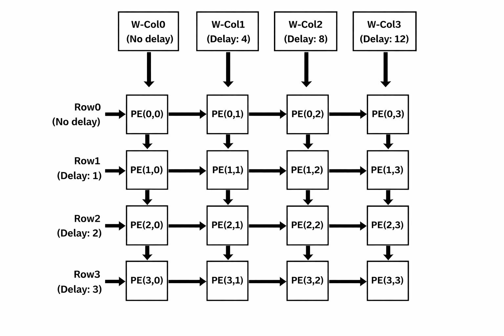<br>
  <b>Figure 1: Elaborated RTL — 4×4 PE Array</b>
</p>

**Core PE MAC operation:**
```
Acc[n] = Acc[n-1] + (pixel_in × weight_in)
```
Each PE passes pixel data rightward and weight data downward, propagating operands through the array each cycle.

### Input Staggering

Inputs are temporally staggered so that the correct pixel meets the correct weight at the correct PE on every clock cycle — aligning the convolution window sliding operation without additional control logic.

| Row | Delay | Input Sequence |
|-----|-------|----------------|
| 0 | 0 cycles | `[1, 7, 13, 2, 8, 14, 3, 9, 15 ...]` |
| 1 | 1 cycle  | `[0, 7, 13, 19, 8, 14, 20 ...]` |
| 2 | 2 cycles | `[0, 0, 13, 19, 25, 14, 20 ...]` |
| 3 | 3 cycles | `[0, 0, 0, 19, 25, 31, 20 ...]` |

| Column | Delay | Input |
|--------|-------|-------|
| 0 | 0 cycles  | `[W1, W4, W7, W2, W5, W8, W3, W6, W9 ...]` |
| 1 | 4 cycles  | Delayed copy of Column 0 |
| 2 | 8 cycles  | Delayed copy of Column 0 |
| 3 | 12 cycles | Delayed copy of Column 0 |

### Python Golden Reference Model

Prior to RTL implementation, a cycle-accurate Python model was developed using a custom **Q8.8 fixed-point class** that mirrors hardware truncation and scaling exactly. The model outputs the final 4×4 feature map and compares it against a NumPy double-precision floating-point reference.

**Q8.8 Format:** 16-bit total · 8 integer bits · 8 fractional bits · scale factor 2⁸ = 256 · resolution 2⁻⁸ = 0.0039

```
FINAL OUTPUT FEATURE MAP (4x4) — Q8.8:          NUMPY REFERENCE:
[[ 474,  519,  564,  609],                       [[ 474,  519,  564,  609],
 [ 744,  789,  834,  879],                        [ 744,  789,  834,  879],
 [1014, 1059, 1104, 1149],                        [1014, 1059, 1104, 1149],
 [1284, 1329, 1374, 1419]]                        [1284, 1329, 1374, 1419]]

✓ MATCH — Maximum error: 0.0000
```

### Verilog RTL Implementation

| Module | File | Role |
|--------|------|------|
| Testbench | `tb_systolic_conv.v` | Clock, reset, staggered input stimuli |
| Top Level | `Systolic_Conv_Top.v` | PE array + BRAM integration + write-back control |
| PE Array | `PE_Array_4x4.v` | 4×4 PE instantiation and data routing |
| PE Core | `PE.v` | MAC unit — Multiplier + Adder + Accumulator |
| Input Buffer | `BRAM_Buffer.v` | Pixel and kernel weight storage |
| Line Buffer | `Line_Buffer.v` | Horizontal shift-register pixel stream |

**PE.v — Core MAC (Q8.8):**
```verilog
always @(posedge clk or posedge rst) begin
    if (rst) begin
        acc        <= 32'd0;
        pixel_out  <= 16'd0;
        weight_out <= 16'd0;
    end else begin
        acc        <= acc + (pixel_in * weight_in);  // Q8.8 MAC
        pixel_out  <= pixel_in;                       // Propagate right
        weight_out <= weight_in;                      // Propagate down
    end
end
```

### Simulation and Verification

| Signal | Raw Q8.8 Value | Decoded (÷256) | Python Reference | Match |
|--------|---------------|----------------|-----------------|-------|
| `out00` | 121344 | 474.00 | 474.00 | ✅ Exact |
| `out20` | 259584 | 1013.99 | 1014.00 | ✅ Quantization only |
| `out33` | 363264 | 1419.00 | 1419.00 | ✅ Exact |

<p align="center">
  <br>
  <b>Figure 2: Vivado Behavioral Simulation Waveform — All 16 PEs computing in parallel</b>
</p>

<p align="center">
  <br>
  <b>Figure 3: Simulation Console Output — Final accumulated values for all 16 PEs</b>
</p>

### I/O Bottleneck and Output BRAM Optimization

The initial design exposed all 16 PE outputs (32 bits × 16 = **512 pins**) directly to top-level ports, yielding **270.95% I/O utilization** — physically unrealizable on any FPGA package.

**Solution:** An output dual-port BRAM with **immediate write-back logic** was integrated. Each PE independently asserts a write-enable upon completing its computation, storing its result in BRAM without waiting for the full array. The host reads the 16 results sequentially over a 32-bit bus, decoupling parallel computation from external readout.

| Resource | Before (Direct IO) | After (Output BRAM) | Change |
|----------|--------------------|---------------------|--------|
| LUT      | 547 (0.86%)        | 710 (1.12%)         | +163 LUTs |
| DSP      | 16 (6.67%)         | 16 (6.67%)          | — |
| BRAM     | 4 (2.96%)          | 4.5 (3.33%)         | +0.5 |
| **IO**   | **569 (270.95%) ❌** | **69 (32.86%) ✅**   | **−500 ports** |

### Timing and Power Analysis (Q8.8)

<table align="center">
  <tr>
    <td align="center">
      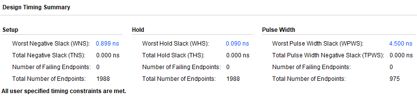<br>
      <b>Figure 4: Design Timing Summary — WNS +0.899 ns</b>
    </td>
    <td align="center">
      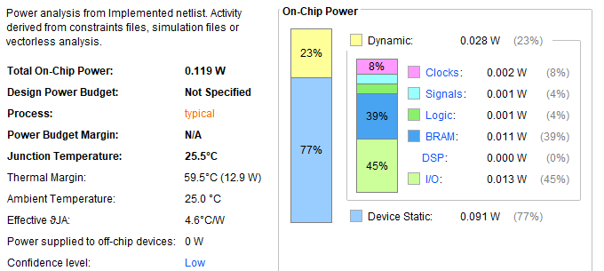<br>
      <b>Figure 5: On-Chip Power Report — 0.119 W total</b>
    </td>
  </tr>
</table>

The positive WNS of +0.899 ns confirms the accumulator carry chain critical path is well within the 10 ns clock period. Dynamic power is dominated by I/O (45%) and BRAM (39%) activity — the core computational logic (DSPs + LUTs) accounts for only 16% of active switching power.

---

## Phase 2 — Multi-Precision Architecture Analysis

The PE architecture was parameterized to evaluate four fixed-point formats, quantifying hardware resource, timing, and power trade-offs as arithmetic precision scales.

| Format | Total Bits | Integer Bits | Fractional Bits | Resolution | Max Value |
|--------|-----------|-------------|----------------|-----------|-----------|
| Q8.8   | 16-bit | 8  | 8  | 2⁻⁸ = 0.0039   | ±128  |
| Q12.4  | 16-bit | 12 | 4  | 2⁻⁴ = 0.0625   | ±2048 |
| Q12.8  | 20-bit | 12 | 8  | 2⁻⁸ = 0.0039   | ±2048 |
| Q12.12 | 24-bit | 12 | 12 | 2⁻¹² = 0.00024 | ±2048 |

---

### Q12.4 — High Dynamic Range (16-bit)

Remaps the 16-bit datapath to 12 integer bits and 4 fractional bits, extending the representable integer range from ±128 to ±2048 at the cost of coarser fractional resolution. Hardware cost is identical to Q8.8 since the physical datapath width is unchanged.

<table align="center">
  <tr>
    <td align="center">
      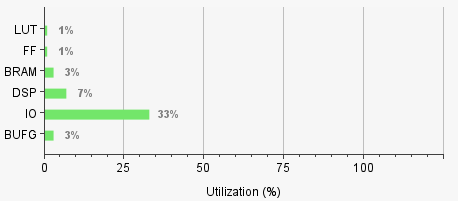<br>
      <b>Resource Utilization</b>
    </td>
    <td align="center">
      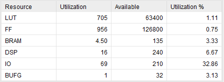<br>
      <b>Utilization Table</b>
    </td>
  </tr>
  <tr>
    <td align="center">
      <br>
      <b>Timing Summary — WNS +1.441 ns</b>
    </td>
    <td align="center">
      <br>
      <b>Power Report — 0.119 W</b>
    </td>
  </tr>
</table>

**WNS +1.441 ns** — best timing margin of all formats. Same 16-bit carry chain as Q8.8. Total power identical at 0.119 W.

---

### Q12.8 — Extended Precision (20-bit)

Expanding the datapath to 20 bits provides both high integer range and fine fractional precision simultaneously. The primary cost is wider interconnects and BRAM interface logic.

<table align="center">
  <tr>
    <td align="center">
      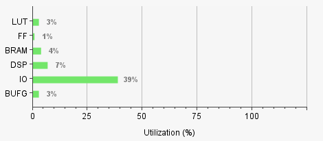<br>
      <b>Resource Utilization</b>
    </td>
    <td align="center">
      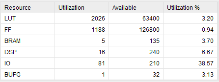<br>
      <b>Utilization Table</b>
    </td>
  </tr>
  <tr>
    <td align="center">
      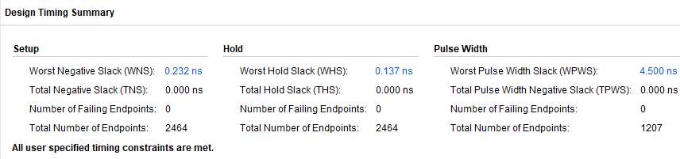<br>
      <b>Timing Summary — WNS +0.232 ns</b>
    </td>
    <td align="center">
      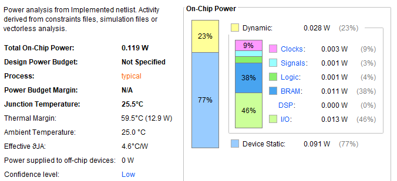<br>
      <b>Power Report — 0.132 W</b>
    </td>
  </tr>
</table>

LUT usage increases ~3× (547 → 2026) relative to 16-bit formats due to wider BRAM mux logic, not PE logic. DSP count remains 16 — the 20-bit multiplication is absorbed within a single DSP48E cascade. **WNS +0.232 ns** — tightest margin observed, from wider accumulator carry propagation. Still meets 100 MHz cleanly.

---

### Q12.12 — Maximum Precision (24-bit)

This format maximizes fractional resolution (2⁻¹² = 0.00024) for high-fidelity applications. The critical architectural implication is that 24×24-bit multiplication **exceeds the native input width of a single Xilinx DSP48E slice (18×25 bits)**, causing the synthesis tool to automatically cascade two DSP48E slices per PE — doubling DSP utilization from 16 to **32 blocks**.

#### Before Optimization

<table align="center">
  <tr>
    <td align="center">
      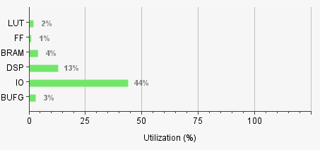<br>
      <b>Resource Utilization</b>
    </td>
    <td align="center">
      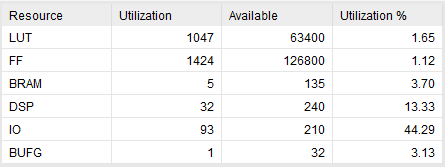<br>
      <b>Utilization Table</b>
    </td>
  </tr>
  <tr>
    <td align="center">
      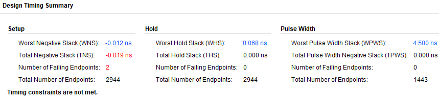<br>
      <b>Timing Summary — WNS −0.012 ns ❌</b>
    </td>
    <td align="center">
      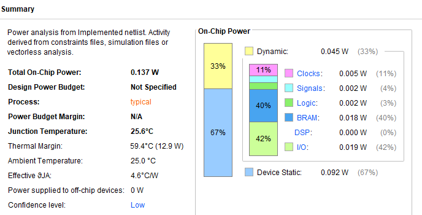<br>
      <b>Power Report — 0.137 W</b>
    </td>
  </tr>
</table>

The single-cycle 24-bit MAC (multiply + accumulate in one clock) misses the 10 ns constraint by **12 picoseconds**. The cascaded DSP-to-DSP routing delay is the root cause — the critical path through the 48-bit accumulator logic marginally exceeds the budget.

#### Resolution — 2-Stage Pipelined MAC

A pipeline register (`mult_stage_reg`) is inserted between the multiplier output and the accumulator adder, decomposing the MAC into two balanced stages:

```
Stage 1 (Cycle N):    mult_stage_reg ← pixel_in × weight_in
Stage 2 (Cycle N+1):  acc ← acc + mult_stage_reg
```

This incurs **1 cycle of additional latency** per PE — negligible in a systolic pipeline where operands are already staggered across many cycles.

#### After Optimization

<table align="center">
  <tr>
    <td align="center">
      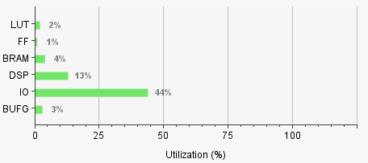<br>
      <b>Resource Utilization</b>
    </td>
    <td align="center">
      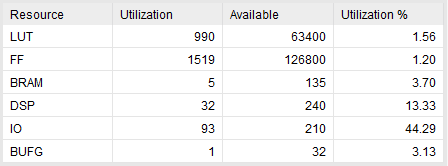<br>
      <b>Utilization Table</b>
    </td>
  </tr>
  <tr>
    <td align="center">
      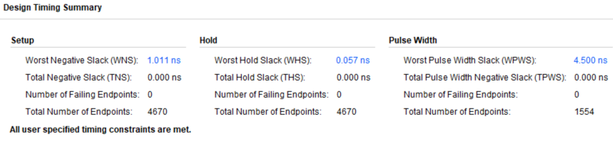<br>
      <b>Timing Summary — WNS +1.011 ns ✅</b>
    </td>
    <td align="center">
      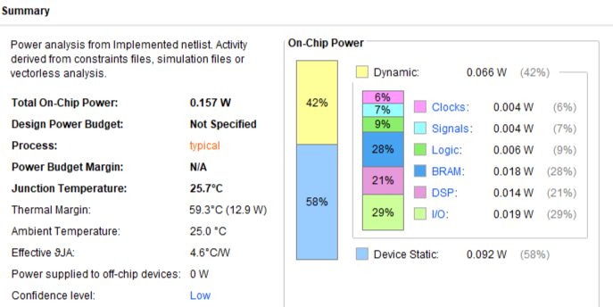<br>
      <b>Power Report — 0.157 W</b>
    </td>
  </tr>
</table>

FF utilization increases by ~95 units (1424 → 1519) for the pipeline registers. LUT count decreases slightly — the synthesis tool packs the decoupled multiply and accumulate stages more efficiently. WNS improves from −0.012 ns to **+1.011 ns**, comparable to the Q8.8 baseline.

---

### Consolidated Results

| Metric | Q8.8 | Q12.4 | Q12.8 | Q12.12 Pipelined |
|--------|:----:|:-----:|:-----:|:----------------:|
| **Bit Width**   | 16 | 16 | 20 | 24 |
| **LUT**         | 710 (1.12%) | 705 (1.11%) | 2026 (3.20%) | 990 (1.56%) |
| **FF**          | 956 (0.75%) | 956 (0.75%) | 1188 (0.94%) | 1519 (1.20%) |
| **DSP**         | 16 (6.67%) | 16 (6.67%) | 16 (6.67%) | **32 (13.33%)** |
| **BRAM**        | 4.5 (3.33%) | 4.5 (3.33%) | 5.0 (3.70%) | 5.0 (3.70%) |
| **IO**          | 69 (32.86%) | 69 (32.86%) | 81 (38.57%) | 93 (44.29%) |
| **WNS**         | +0.899 ns | +1.441 ns | +0.232 ns | +1.011 ns |
| **Total Power** | 0.119 W | 0.119 W | 0.132 W | 0.157 W |
| **Dyn. Power**  | 0.028 W | 0.028 W | 0.041 W | 0.066 W |

**Observations:**
- Q8.8 and Q12.4 are physically equivalent in hardware — identical 16-bit datapaths, differing only in fixed-point radix point placement.
- The 16→20-bit transition (Q12.8) triples LUT usage due to wider BRAM interface logic, not PE arithmetic.
- The 20→24-bit transition (Q12.12) doubles DSP blocks from automatic cascade and requires pipeline insertion to meet timing.
- All formats operate at **100 MHz** with positive WNS post-implementation.
- Maximum power across all variants is **0.157 W**, confirming viability for edge AI deployment.

---

## Phase 3 — Sobel Edge Detection on 640×640 KITTI Image

### System Architecture

The validated 4×4 PE array is deployed on a full 640×640 grayscale KITTI autonomous driving image. Since each array invocation processes one 6×6 tile, the image is decomposed into a sequence of tiles using a sliding-window BRAM pipeline.

<p align="center">
  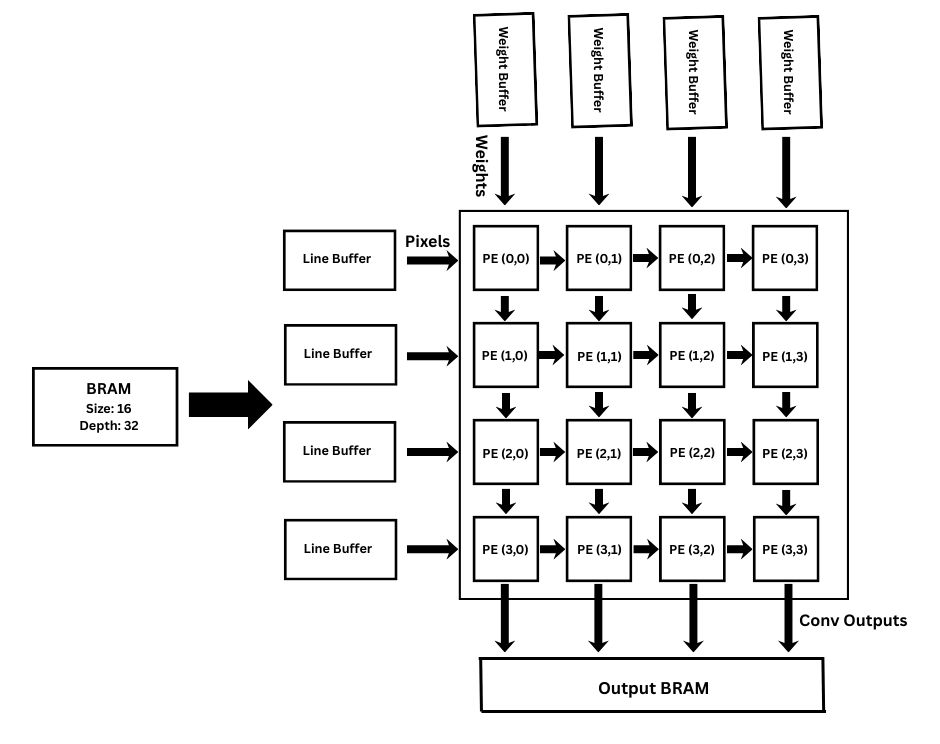<br>
  <b>Figure 6: BRAM-Based Tiled Processing Pipeline for 640×640 Image</b>
</p>

### Tiling and Pipeline

| Parameter | Value |
|-----------|-------|
| Input image | 640 × 640 (grayscale) |
| Tile (window) size | 6 × 6 |
| Valid output per tile | 4 × 4 |
| Output feature map | 638 × 638 |
| Total tiles | 638 × 638 = **407,044** |

**Per-tile execution sequence:**
```
1. Load 6×6 pixel tile → Pixel BRAM
2. Load 3×3 Sobel kernel → Weight BRAM
3. Assert start → staggered PE computation begins
4. Wait for done → all 16 PEs valid
5. Read 16 results from Output BRAM
6. Write 4×4 block to output buffer at (row, col)
7. Advance tile pointer → repeat
```

**Sobel Kernels:**
```
Sobel-X:              Sobel-Y:
-1   0  +1            -1  -2  -1
-2   0  +2             0   0   0
-1   0  +1            +1  +2  +1
```
Edge magnitude: `E = |Gx| + |Gy|`  (L1 approximation)

Sobel-X and Sobel-Y are computed as independent passes over the image and combined to produce the final edge map.

### Output Results

<p align="center">
  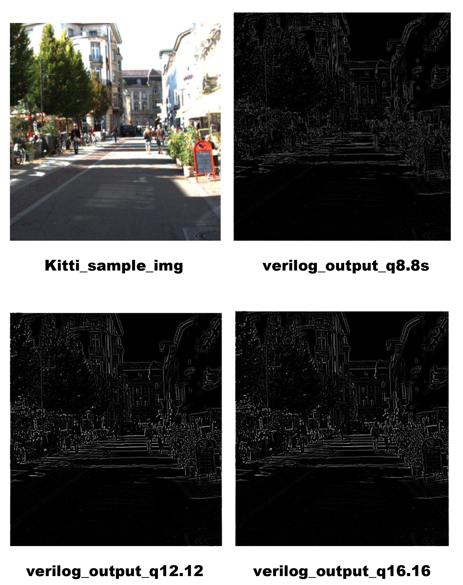<br>
  <b>Figure 7: Sobel Edge Detection Results — KITTI Scene across Precision Formats</b>
</p>

| Format | Edge Quality | Observation |
|--------|-------------|-------------|
| Q8.8   | Low — dominant edges only | Limited fractional precision quantizes small gradients to zero. Major boundaries (road, buildings) captured; fine detail lost. |
| Q12.12 | High — fine structural edges | Increased fractional resolution recovers subtle gradients. Window frames, vegetation boundaries, pavement markings become visible. |
| Q16.16 | Highest — maximum fidelity | All structural and textural edges preserved. Optimal for downstream perception (lane detection, object segmentation). |

---

## How to Run

### Python Golden Reference
```bash
cd python_model/
python systolic_q8.8_reference.py
# Expected: ✓ MATCH — Maximum error: 0.0000
```

### Verilog Simulation (Vivado)
1. Create RTL project; add all files from `src/` as Design Sources
2. Add `testbench/tb_systolic_conv.v` as Simulation Source
3. Set `tb_systolic_conv` as simulation top
4. Run **Behavioral Simulation** → observe `done`, `out00`–`out33`

### Verilog Simulation (Icarus Verilog)
```bash
iverilog -o sim_out testbench/tb_systolic_conv.v src/*.v
vvp sim_out
gtkwave dump.vcd   # optional waveform viewer
```

### FPGA Implementation (Vivado)
```bash
# Add constraints/timing.xdc to project
# Run: Synthesis → Implementation → Generate Bitstream
# Verify: WNS > 0 in Design Timing Summary
```

### KITTI Tiling Pipeline
```bash
cd kitti_pipeline/
python tile_generator.py  --input ../results/phase_3/kitti_sample.png --output tiles/
python sobel_driver.py    --tiles tiles/ --format q8.8 --output output/
python result_assembler.py --results output/ --save ../results/phase_3/edge_map.png
```

---

## Dependencies

| Tool | Purpose |
|------|---------|
| Xilinx Vivado 2020.x+ | Synthesis, P&R, STA, Power Analysis (Artix-7) |
| Python 3.8+ | Golden reference model, KITTI tiling pipeline |
| NumPy | Matrix operations |
| Pillow | Image I/O for KITTI pipeline |
| Icarus Verilog *(optional)* | Open-source RTL simulation |
| GTKWave *(optional)* | VCD waveform viewer |

```bash
pip install numpy pillow
```

---

## Contributors

| Name | GitHub |
|------|--------|
| Madhan Lankalapalli | [@MadhanLankalapalli](https://github.com/MadhanLankalapalli) |
| Prasanth Behara | [@PrasanthBehara](https://github.com/PrasanthBehara) |
| Rupa Lakshmi Koram | [@RupaLakshmiKoram](https://github.com/RupaLakshmiKoram) |

---

<div align="center">
Designed and implemented at <b>RGUKT</b><br>
<i>Design and Implementation of a 4×4 Systolic PE Array for 2D Convolution</i>
</div>
